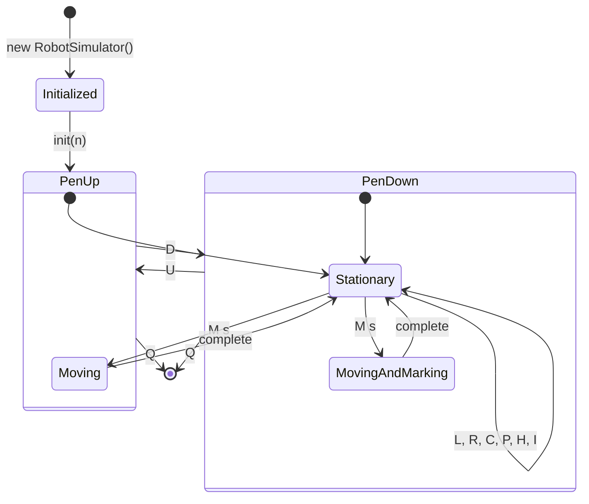

```mermaid

stateDiagram-v2
    [*] --> Initialized : new RobotSimulator()
    
    Initialized --> PenUp : init(n)
    
    state PenUp {
        [*] --> Stationary
        Stationary --> Moving : M s
        Moving --> Stationary : complete
        Stationary --> Stationary : L, R, C, P, H, I
    }
    
    state PenDown {
        [*] --> Stationary
        Stationary --> MovingAndMarking : M s
        MovingAndMarking --> Stationary : complete
        Stationary --> Stationary : L, R, C, P, H, I
    }
    
    PenUp --> PenDown : D
    PenDown --> PenUp : U
    
    PenUp --> [*] : Q
    PenDown --> [*] : Q

```
