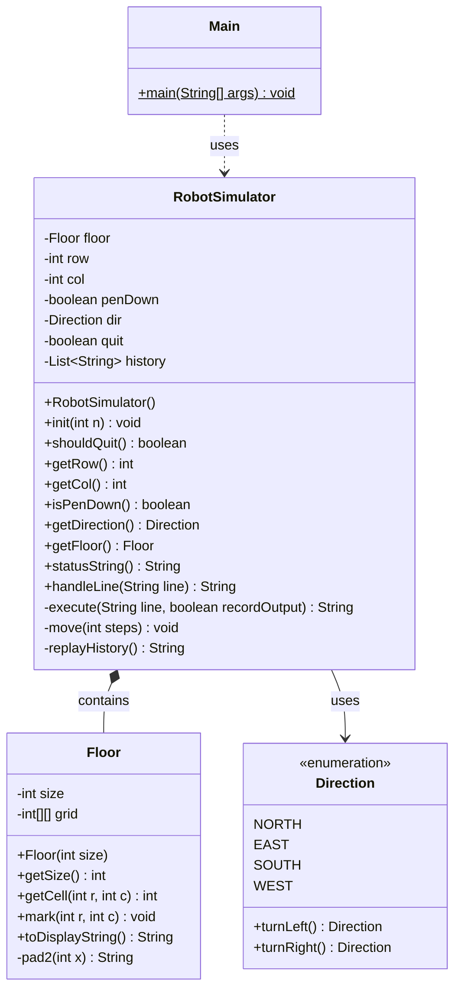

# UML Class Diagram - Robot Simulator

This diagram represents the class structure of the Robot Simulator application.

## Class Descriptions

- **Main**: Entry point for the application
- **RobotSimulator**: Core simulator managing robot state and commands
- **Floor**: Represents the drawing surface grid
- **Direction**: Enum for cardinal directions with turn logic
